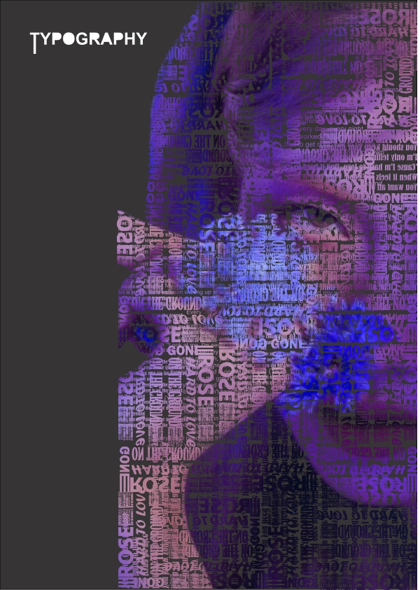

# CorelDRAW Typography Design

A CorelDRAW typography project combining text and image composition.

## About

This project demonstrates a typography design created by combining text with an image using CorelDRAW.

The design was created as a graphic design practice project, focusing on typography, visual composition, and the integration of text with imagery.

## Final Design

## Reference Image

## Source File

The original CorelDRAW source file is included in the repository.

## Software

* CorelDRAW

## Skills Demonstrated

* Typography
* Text and image composition
* Visual composition
* Text manipulation
* Image integration
* Color and layout
* Graphic design

## Purpose

This project was created as practice for applying typography and visual composition techniques in CorelDRAW and is included as part of a personal portfolio.
